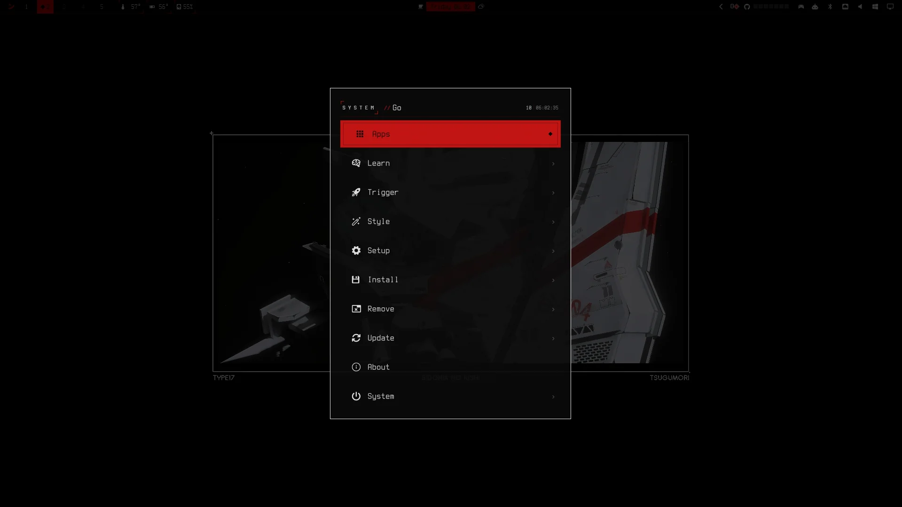
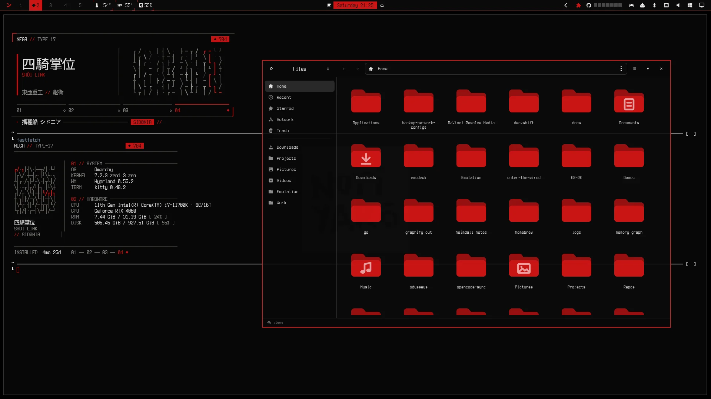
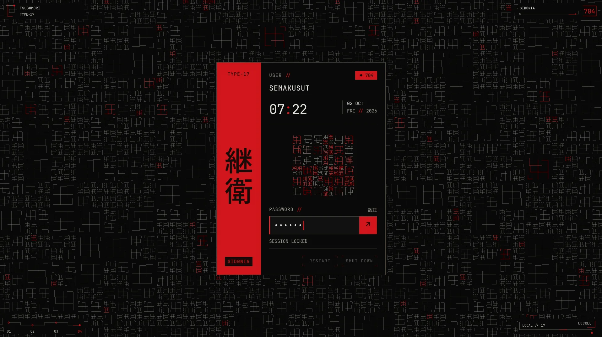

# Negatsugumori

Tema Omarchy bernuansa Tsugumori (*Knights of Sidonia*) — merah `#cc1515` di atas
hitam `#0a0a0a`, dengan lock screen, bar, dan launcher menu yang reskin penuh.

Ada **dua jalur instalasi**. Jalur pertama cukup warna dan tidak butuh root;
jalur kedua opsional dan menimpa file root-owned.

## Pratinjau

Desktop dengan wallpaper:



Launcher Walker:



Aplikasi terbuka:



---

## Jalur 1 — theme saja (disarankan)

Langsung dipakai lewat mechanism Omarchy. Tidak ada `git clone`, tidak ada `sudo`,
tidak ada `install.sh`.

```bash
omarchy theme install https://github.com/semakusut/omarchy-negatsugumori-theme
```

Lalu pilih **Theme → negatsugumori**. Selesai.

Yang berubah: palet seluruh aplikasi, wallpaper, warna bar, dan tampilan
launcher Walker. Semua di-*generate* dari `colors.toml` oleh
`omarchy-theme-set-templates`.

> Nama theme `negatsugumori` diturunkan dari nama repo. Kalau repo di-fork, prefix
> `omarchy-` dan suffix `-theme` akan otomatis dibuang — nama theme ikut berubah.

## Jalur 2 — reskin penuh (opsional, butuh root)

Jalur 1 tidak menimpa file root-owned, jadi bar/lock/menu masih stock.
Untuk itu ada `install.sh`:

```bash
git clone https://github.com/semakusut/omarchy-negatsugumori-theme
cd omarchy-negatsugumori-theme
./install.sh
omarchy restart shell
```

Tanpa `sudo`:

```bash
TUGUMORI_SKIP_SUDO=1 ./install.sh
```

`install.sh` memverifikasi palet dulu — kalau `colors.toml` sudah drift dari
payload QML, install dibatalkan, bukan dipasang dalam keadaan setengah benar.

Font terminal (opsional, paket sistem — bukan file di repo ini):

```bash
omarchy-install-font "IBM Plex Mono Nerd" ttf-ibmplex-mono-nerd
```

---

## Apa yang ikut berubah

### Jalur 1

**Di-*generate* otomatis dari `colors.toml`** — tidak ada file per-aplikasi di
repo ini:

Alacritty, Foot, Ghostty, Kitty, btop, Chromium, Helix, Neovim (LazyVim +
Aether), VS Code, Claude, Pi, T3Code, Hyprland, keyboard RGB, Obsidian, shell.

**Disertakan manual**, karena Omarchy tidak menyediakan template-nya:

- `walker.css` — warna launcher Walker. Tanpa ini Walker jatuh ke default GTK.
- `backgrounds/` — wallpaper. Tanpa ini `theme-set` memunculkan
  `No background was found for theme` dan wallpaper tidak berubah.
- `preview.png` — thumbnail di carousel theme picker.

### Jalur 2

Di-patch oleh `install.sh`:

- **Bar** — jam pill, logo kanji di menu, Workspaces, tombol widget
- **Launcher menu**
- **Lock screen** — semua fase, shader included

## Yang **tidak** ikut

Jujur, karena ini yang paling sering bikin orang kecewa:

- **fzf, lazygit, gitui, htop, delta, zoxide, starship** — Omarchy tidak punya
  template untuk mereka, jadi palet tidak bisa menjangkau. Butuh konfigurasi
  manual per aplikasi.
- **Ikon** — `icons.theme` bawaan dipakai apa adanya.

## File yang sengaja tidak ada di repo

`omarchy-theme-set` menolak file-file ini pada theme hasil `git clone`, karena
semuanya di-*generate* dari `colors.toml`:

`alacritty.toml`, `foot.ini`, `ghostty.conf`, `kitty.conf`, `vscode.json`,
dan seluruh `*.lua`.

Kalau salah satunya ikut ter-commit, warnanya bisa bentrok dengan hasil generate
dan bug-nya sulit dilacak. `tests/audit.sh` menjaga ini — bersama symlink,
yang juga dibuang diam-diam.

## Lock screen perlu `install.sh`

Stock `LockView.qml` **hardcode** warnanya dan tidak membaca palet. Tanpa
`./install.sh`, lock screen tetap warna bawaan — bukan karena theme gagal, tapi
karena memang tidak ada jalur mewarnainya.

Tombol power tetap dua-klik: klik pertama menyiagakan, klik kedua menjalankan.
Guard `sessionLock.secure` bawaan Omarchy tidak pernah disentuh.

## Setiap `omarchy update`

Hook `post-update.d` mengembalikan file yang wipes oleh update. Sudoers dibuat
otomatis: 12 `cp` + 1 `mkdir`, tanpa wildcard. Cabut aksesnya dengan:

```bash
sudo rm /etc/sudoers.d/omarchy-tsugumori
```

Lalu `omarchy update` mengembalikan file asli.

## Palet

`colors.toml` adalah satu-satunya sumber warna. Empat warna jangkar di payload
QML dicek terhadapnya setiap kali `install.sh` jalan; kalau tidak cocok, install
dibatalkan. Warna `walker.css` dicek oleh `tests/audit.sh`. Ramp netral yang lain
diwarisi dari lock screen bawaan Omarchy — lihat [CREDITS.md](CREDITS.md).

## Uninstall

```bash
sudo rm /etc/sudoers.d/omarchy-tsugumori
rm ~/.config/omarchy/hooks/post-update.d/restore-tsugumori-*.hook
omarchy update
```

Lalu kembalikan tema lewat **Install → Theme** ke tema lain.

## Lisensi

MIT. Lihat [LICENSE](LICENSE) dan [CREDITS.md](CREDITS.md).